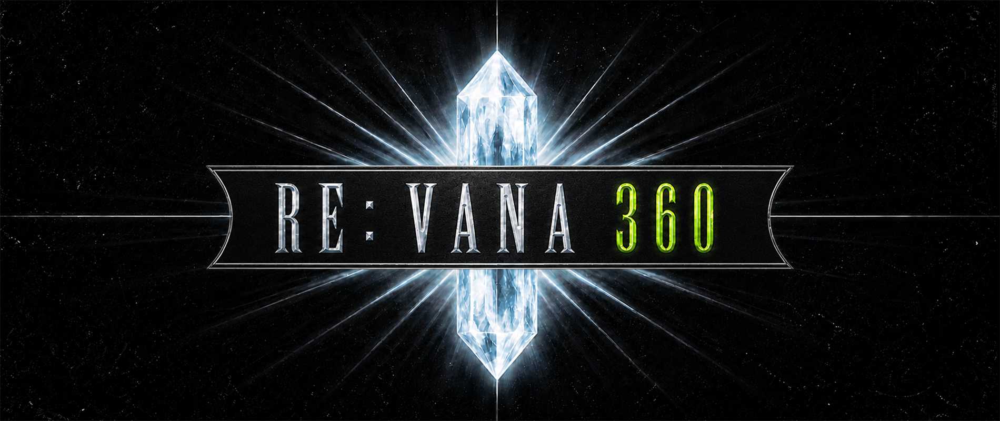

Static recompilation of the Xbox 360 release of Final Fantasy XI, built on ReXGlue for use with LandSandBoat.

Vana360 includes no copyrighted game materials.
This project is not affiliated with Square Enix or Microsoft. Neither company
endorses it.
You must own the supported Final Fantasy XI: Ultimate Collection USA release.
All trademarks belong to their respective owners.

## Play Vana360

Vana360 is currently a development preview.
Stable player archives are not yet available.

- When available, download and completely extract an archive from the
  [Vana360 releases page](https://github.com/REVana360/vana360/releases).
- Verify a legally owned ISO with
  `.\scripts\verify-disc.ps1 -Path <path-to-iso>`.
- Extract game data from your legally owned supported disc into a local folder.
- Build Vana360 when no release archive is available.
- Run `revana.exe --game_data_root=<path-to-game-data-root>`.
- Use the maintained server revision pinned by
  [`vana360-lsb.lock.json`](vana360-lsb.lock.json).
- Configure the external connection as described by the
  [packaged player guide](scripts/packaging/README.txt).

Windows 11 x64 with a Direct3D 12 capable GPU is the supported player platform.
The exact disc size, hash, and module boundary are in the
[supported input guide](docs/supported-disc.md).

## Development

- [Build and package Vana360](docs/building.md)
- [Supported input](docs/supported-disc.md)
- [Architecture](docs/architecture.md)
- [Style guide](docs/style-guide.md)

Pull requests are welcome. Read [CONTRIBUTING.md](CONTRIBUTING.md) before you
open one. AI-assisted changes follow the same
[public contribution policy](docs/ai_agents/README.md).

## Acknowledgements

- [ReXGlue SDK](https://github.com/rexglue/rexglue-sdk)
- [LandSandBoat](https://github.com/LandSandBoat/server)

## License

Code and documentation use the [GNU General Public License version 3](LICENSE).
License notices for external components are in
`REXGLUE-LICENSE.txt`. Retail game content is not distributed by this project.
